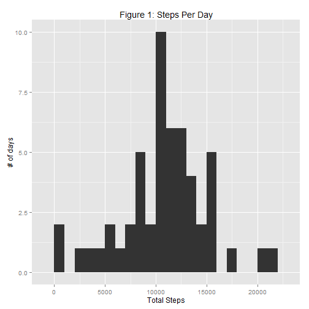
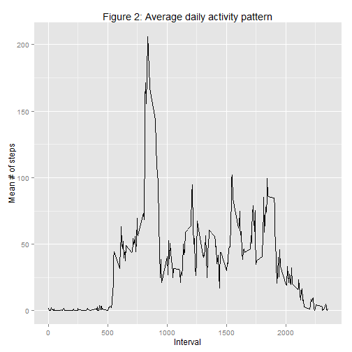
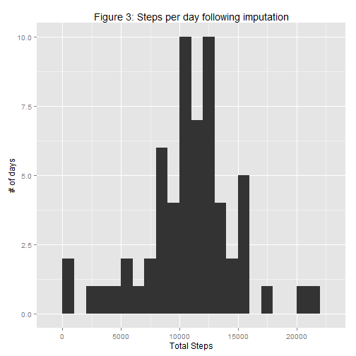
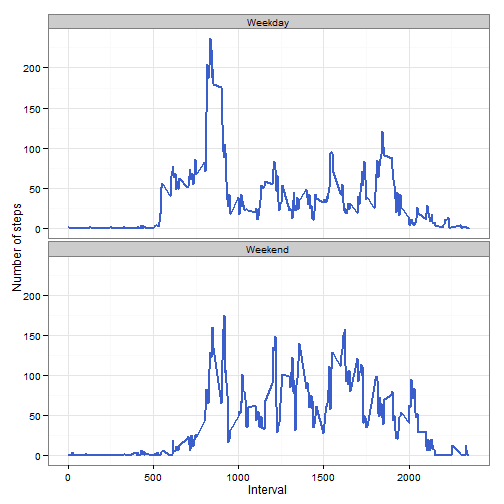

## Peer Assessment 1  
=====================
Reproducible Research  
Scott Wolf  

### Loading and preprocessing the data
Show any code that is needed to  
1. Load the data (i.e. read.csv())  
2. Process/transform the data (if necessary) into a format   suitable for your analysis  

**Step 1: Set working directory**  

```r
setwd("C:/Users/Scot Wolf/Google Drive/MOOCs/Data Science Specialization (Johns Hopkins - Coursera)/5 Reproducible Research/Peer Assessment 1")  
```

**Step 2: Read data to R**  

```r
activity <- read.csv("activity.csv")  
```

**Step 3: Convert "date" column to POSIXct date format**  

```r
activity$date <- as.POSIXct(strptime(activity$date, "%Y-%m-%d"))
```


### What is mean total number of steps taken per day?  
For this part of the assignment, you can ignore the missing values in the dataset.  
1. Make a histogram of the total number of steps taken each day  
2. Calculate and report the mean and median total number of steps taken per day  

**Aggregate total steps taken each day:**

```r
library(plyr)

totalstepsbydate<- ddply(activity, .(date), summarize, totalstepsdate = sum(steps))
```

**Histogram:**

```r
library(ggplot2)  

hist <- qplot(totalstepsdate, data = totalstepsbydate, 
              binwidth = 1000, geom = "histogram") + 
        labs(title='Figure 1: Steps Per Day', 
             y='# of days', x='Total Steps')
plot(hist)
```

 

**Mean total steps per day:**

```r
mean(totalstepsbydate$totalstepsdate, na.rm=TRUE)
```

[1] 10766
  
**Median total steps per day:**

```r
median(totalstepsbydate$totalstepsdate, na.rm=TRUE)
```

[1] 10765


### What is the average daily activity pattern?  
1. Make a time series plot (i.e. type = "l") of the 5-minute interval (x-axis) and the average number of steps taken, averaged across all days (y-axis)
2. Which 5-minute interval, on average across all the days in the dataset, contains the maximum number of steps?

**Compute mean steps taken by interval:**  

```r
meanstepsbyinterval<- ddply(activity, .(interval), summarize, meanstepsinterval = mean(steps, na.rm = TRUE))
```


```r
timeseries <- ggplot(meanstepsbyinterval, aes(x = interval, y = meanstepsinterval))
plot(timeseries + geom_line()
        + labs(title="Figure 2: Average daily activity pattern")
        + labs(y="Mean # of steps")
        + labs (x="Interval"))
```

 

Interval with maximum mean number of steps:

```r
maxinterval <- which.max(meanstepsbyinterval$meanstepsinterval)
meanstepsbyinterval[maxinterval, 1] 
```

[1] 835

### Imputing missing values  
Note that there are a number of days/intervals where there are missing values (coded as NA). The presence of missing days may introduce bias into some calculations or summaries of the data.  
1. Calculate and report the total number of missing values in the dataset (i.e. the total number of rows with NAs)  
2. Devise a strategy for filling in all of the missing values in the dataset. The strategy does not need to be sophisticated. For example, you could use the mean/median for that day, or the mean for that 5-minute interval, etc.  
3. Create a new dataset that is equal to the original dataset but with the missing data filled in.  
4. Make a histogram of the total number of steps taken each day and Calculate and report the mean and median total number of steps taken per day. Do these values differ from the estimates from the first part of the assignment? What is the impact of imputing missing data on the estimates of the total daily number of steps?  

**(1) Number of missing values:**

```r
missing <- activity[!complete.cases(activity),]
nrow(missing)
```

[1] 2304

**(2) Strategy for imputing missing values:**  
Missing values are imputed using the mean of each 5 second interval from each day of the week.

**(3) Imputation:**  
**Compute day of week for imputation:**

```r
activity$day <- weekdays(activity$date)
```

**Imputation:**

```r
dayintervalmean <- aggregate(steps ~ interval + day, activity, mean, na.rm = TRUE)

imputedactivity <- merge(activity, dayintervalmean, by=c("interval", "day"))

imputedactivity <- transform(imputedactivity, steps.x = ifelse(is.na(steps.x),steps.y,steps.x))

imputedactivity <- data.frame(imputedactivity[,1:4])

names(imputedactivity) <- c("interval", "day","steps", "date")
```

**Aggregate steps by date to get total number of steps per day**

```r
totalstepsbydateimputed <- aggregate(steps ~ date, imputedactivity, sum)
```

**(4) Create a histogram of total number of steps per day following imputation**

```r
histimpute <- qplot(steps, data = totalstepsbydateimputed, 
                    binwidth = 1000, geom = "histogram") + 
        labs(title='Figure 3: Steps per day following imputation', 
             y='# of days', x='Total Steps')
plot(histimpute)
```

 

**Mean total steps per day following imputation:**

```r
mean(totalstepsbydateimputed$steps, na.rm=TRUE)
```

[1] 10821
  
**Median total steps per day following imputation:**

```r
median(totalstepsbydateimputed$steps, na.rm=TRUE)
```

[1] 11015
**The mean increases slightly (from 10766 to 10821), and the median increases to a larger extent (from 10765 to 11015) due to the imputation of missing values.**


### Are there differences in activity patterns between weekdays and weekends?  
For this part the weekdays() function may be of some help here. Use the dataset with the filled-in missing values for this part.  
1. Create a new factor variable in the dataset with two levels - "weekday" and "weekend" indicating whether a given date is a weekday or weekend day.  
2. Make a panel plot containing a time series plot (i.e. type = "l") of the 5-minute interval (x-axis) and the average number of steps taken, averaged across all weekday days or weekend days (y-axis). The plot should look something like the following, which was creating using simulated data:  

**Classifying days of the week and aggregating them:**

```r
imputedactivity$daytype <- ifelse(imputedactivity$day %in% c("Saturday", "Sunday"),"Weekend", "Weekday")

imputedactivitydaytypeagg <- aggregate(steps ~ interval + daytype, imputedactivity, mean)
```

**Creating the plot:**

```r
ggplot(imputedactivitydaytypeagg, aes(x=interval,y=steps)) + 
        geom_line(color="royalblue3",size=1) + 
        facet_wrap(~daytype, nrow=2, ncol=1) + 
        labs(x="Interval",y="Number of steps") +
        theme_bw()
```

 
